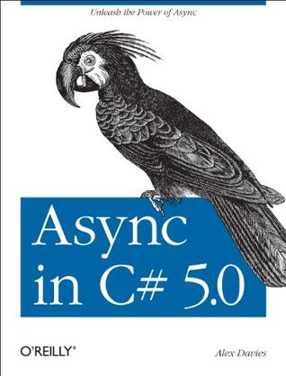

# C#/.NET 学习之路——从入门到放弃
```
此系列只包含C#/CLR 学习，不包含应用框架（ASP.NET , WPF , WCF 等）及架构设计学习书籍和资料。
```
## C# 入门
1. [《C# 本质论》](https://book.douban.com/subject/26242121/)  
     
     

2. [《果壳中的C#》](https://book.douban.com/subject/25981895/)  
     
     

## 设计模式
1. [《大话设计模式》](https://book.douban.com/subject/2334288/)  
     
     

2. [《Head First 设计模式》](https://book.douban.com/subject/2243615/)  
     
     

## C# 进阶
1. [《深入理解C#》](https://book.douban.com/subject/25843328/)  
     
     

2. [《你必须知道的.NET》](https://book.douban.com/subject/6753837/)  
     
     

3. [《C#高效编程 : 改进C#代码的50个行之有效的办法(第2版)》](https://book.douban.com/subject/5360961/)  
     
     

4. [《More Effective C#中文版 : 改善C#程序的50个具体办法》](https://book.douban.com/subject/4101150/)  
     
     

## C# 进阶Ⅱ<异步/多线程>
1. [《Async in C# 5.0》](https://book.douban.com/subject/11592351/)  
     
     

2. [《C#并发编程经典实例》](https://book.douban.com/subject/26274181/)  
     
     

3. [《C#多线程编程实战》](https://book.douban.com/subject/26574917/)  
     
     


## 设计模式进阶
1. [《设计模式》](https://book.douban.com/subject/1052241/)  
     
     

2. [《设计模式沉思录》](https://book.douban.com/subject/26756552/)  
     
     

3. [《重构 : 改善既有代码的设计》](https://book.douban.com/subject/4262627/)  
     
     

4. [《软件框架设计的艺术》](https://book.douban.com/subject/6003832/)  
     
     

## .NET 框架/CLR
1. [《CLR via C#》](https://book.douban.com/subject/26285940/)  
     
     

2. [《.NET本质论 第1卷:公共语言运行库》](https://book.douban.com/subject/1151348/)  
     
     

3. [《.NET探秘 : MSIL权威指南》](https://book.douban.com/subject/4037255/)  
     
     

4. [《Pro .NET Performance》](https://book.douban.com/subject/17253784/)  
     
     

5. [《Shared Source CLI Essentials》](https://book.douban.com/subject/1484763/)  
     
     

## 调试/编译
1. [《.NET高级调试》](https://book.douban.com/subject/5346548/)  
     
     

2. [《Microsoft.NET和Windows应用程序调试》](https://book.douban.com/subject/1169992/)  
     
     

3. [《微软.NET程序的加密与解密》](https://book.douban.com/subject/3274597/)  
     
     

4. [《.NET Development Using the Compiler API》](https://book.douban.com/subject/26833340/)  
     
     

## 规范
1. [《C# Language Specification》](https://msdn.microsoft.com/en-us/library/ms228593(v=vs.140).aspx)  

2. [《Standard ECMA-334 C# Language Specification 4th edition》](http://www.ecma-international.org/publications/standards/Ecma-334.htm) 

3. [《Standard ECMA-335 Common Language Infrastructure (CLI) 6th edition》](http://www.ecma-international.org/publications/standards/Ecma-335.htm) 

4. [《.NET设计规范 : 约定、惯用法与模式》](https://book.douban.com/subject/4805165/) 
     
     
